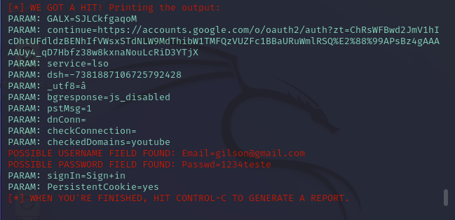
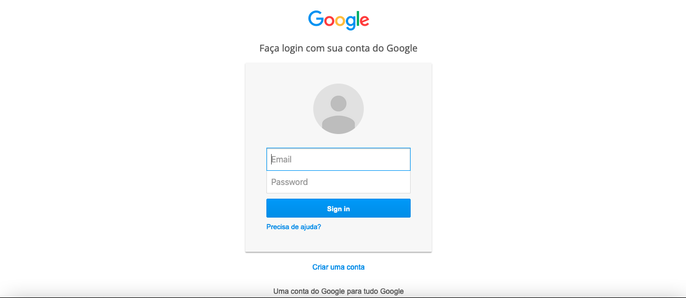

# Phishing para captura de senhas do Google

### Ferramentas

- Kali Linux
- setoolkit

### Configurando o Phishing no Kali Linux

- Acesso root: ``` sudo su ```
- Iniciando o setoolkit: ``` setoolkit ```
- Tipo de ataque: ``` Social-Engineering Attacks ```
- Vetor de ataque: ``` Web Site Attack Vectors ```
- Método de ataque: ```Credential Harvester Attack Method ```
- Método de ataque: ``` Web Templates ```
- Obtendo o endereço da máquina: ``` ifconfig ```
- URL para clone: http://www.google.com

### Resutados






<div id='contatos' align="center">
  <p align="center">Made with 💜 by Humberto Luciano</p>
  <div id="contatos" align="center">
    <a href="https://www.linkedin.com/in/humberto-luciano/" target="_blank"></a>
</div>